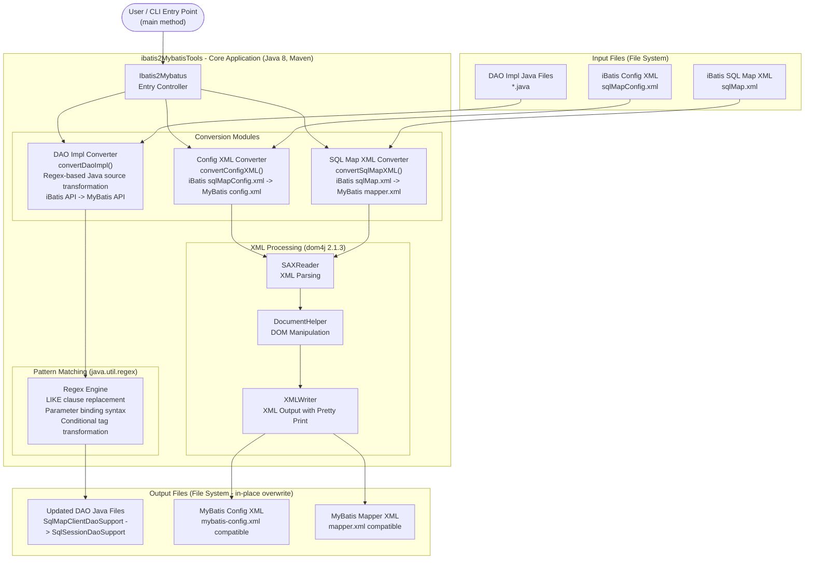

# Architecture Diagram

This diagram illustrates the architecture of the iBatis-to-MyBatis3 migration tool, a standalone Java command-line application that transforms iBatis 2.x configurations and DAO source files into MyBatis 3 compatible format.

## Application Architecture

