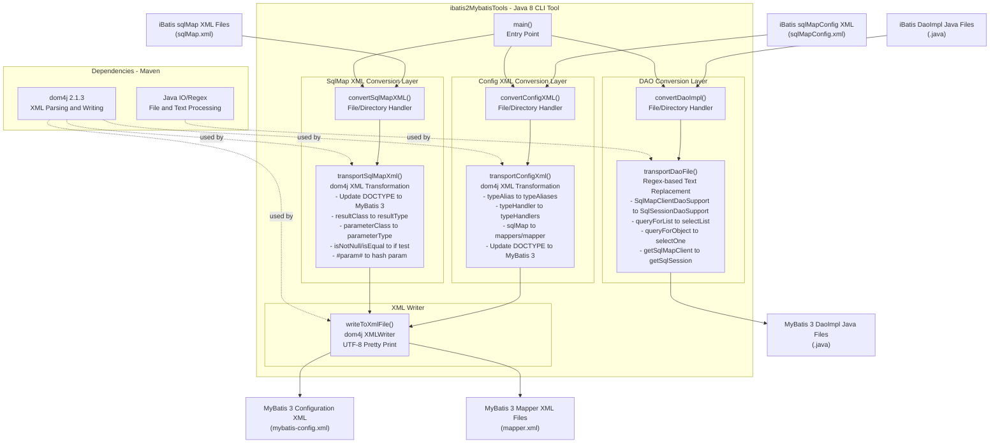

# Architecture Diagram

A standalone Java 8 command-line tool that migrates iBatis 2 configurations and DAO implementations to MyBatis 3 format using XML parsing and regex-based text replacement.

## Application Architecture

