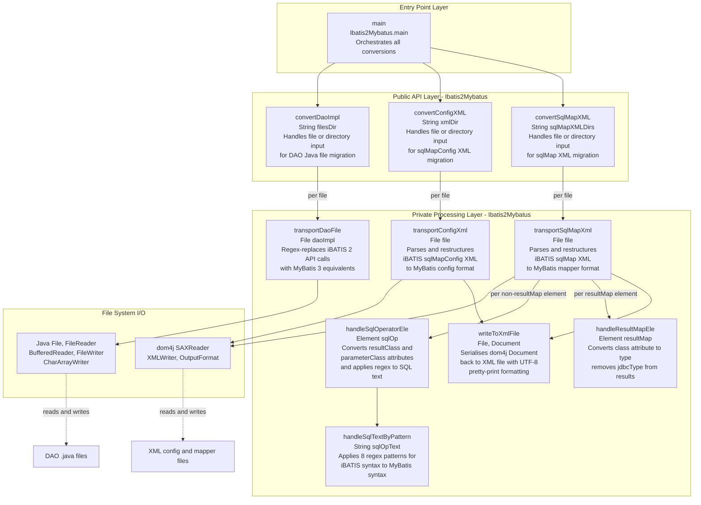

# Component Relationship Diagram

> Generated by the `assessment-component-relationship` skill for **ibatis2MybatisTools** (Java 8, Maven)

## Overview

The entire application is implemented in a single class — `Ibatis2Mybatus` — with three public entry-point methods and several private helper methods. There are no controllers, services, repositories, or dependency-injected components. The architecture is a procedural utility class with a `main()` entry point.

## Component Relationship Diagram

## Component Inventory

| Component | Type | Visibility | Responsibility |
|-----------|------|-----------|----------------|
| `Ibatis2Mybatus.main` | Entry point | public static | Coordinates all three conversion workflows |
| `convertDaoImpl` | Public API | public static | Iterates files, delegates to transportDaoFile |
| `convertConfigXML` | Public API | public static | Iterates files, delegates to transportConfigXml |
| `convertSqlMapXML` | Public API | public static | Iterates files, delegates to transportSqlMapXml |
| `transportDaoFile` | Core logic | private static | String-replaces iBATIS 2 API imports and method calls with MyBatis 3 equivalents using regex |
| `transportConfigXml` | Core logic | private static | Parses sqlMapConfig XML with dom4j and restructures elements (typeAlias→typeAliases, sqlMap→mappers, etc.) |
| `transportSqlMapXml` | Core logic | private static | Parses sqlMap XML with dom4j, updates DOCTYPE, delegates element handling |
| `handleSqlOperatorEle` | Helper | private static | Replaces resultClass/parameterClass attributes, applies text regex |
| `handleSqlTextByPattern` | Helper | private static | Eight sequential regex replacements for iBATIS syntax (like, #param#, isNotNull, isEqual, etc.) |
| `handleResultMapEle` | Helper | private static | Converts resultMap attribute names and removes jdbcType |
| `writeToXmlFile` | Helper | private static | Serialises dom4j Document to file with pretty-print UTF-8 formatting |

## Interaction Summary

- **No inter-class dependencies**: All logic is in one class (`Ibatis2Mybatus`)
- **No dependency injection**: All methods are static, no instances required
- **No shared mutable state**: All state is method-local (no class-level fields except constants)
- **Sequential, non-concurrent processing**: Files are processed one at a time in a loop
- **Tight coupling to file system**: Methods accept `File` or directory path strings and read/write in-place
