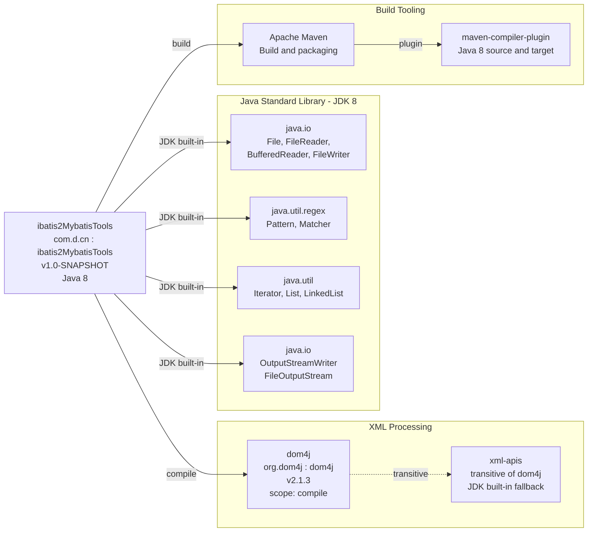

# Dependency Map

> Generated by the `assessment-dependency-map` skill for **ibatis2MybatisTools** (Java 8, Maven)

## Overview

The project declares a single direct compile-scope dependency — **dom4j 2.1.3** — for XML parsing and writing. All other capabilities come from the Java 8 standard library. No test dependencies, no logging framework, and no dependency management (BOM/parent POM) are present.

## Dependency Map Diagram

## Dependency Details

### Direct Dependencies

| Dependency | Group | Artifact | Version | Scope | Purpose |
|-----------|-------|----------|---------|-------|---------|
| dom4j | org.dom4j | dom4j | 2.1.3 | compile | XML document parsing (SAXReader), manipulation (Document, Element, Attribute), and writing (XMLWriter, OutputFormat) |

### JDK Built-in (No external dependency)

| Package | Usage |
|---------|-------|
| java.io | FileReader, BufferedReader, CharArrayWriter, FileWriter, FileOutputStream, OutputStreamWriter |
| java.util.regex | Pattern, Matcher — regex-based iBATIS-to-MyBatis text substitution |
| java.util | Iterator, Collection, ArrayList, Arrays, LinkedList |

### Build Plugins

| Plugin | Group | Version | Purpose |
|--------|-------|---------|---------|
| maven-compiler-plugin | org.apache.maven.plugins | (default) | Compiles Java source at Java 8 source/target compatibility |

## Dependency Gap Analysis

| Category | Status | Notes |
|----------|--------|-------|
| XML Processing | Covered | dom4j 2.1.3 |
| Logging | Missing | Only System.out.println — no SLF4J, Logback, or Log4j |
| Testing | Missing | No JUnit or Mockito dependency |
| CLI Framework | Missing | No picocli, Commons CLI, or similar |
| Dependency Management | Missing | No parent BOM or dependencyManagement block |
