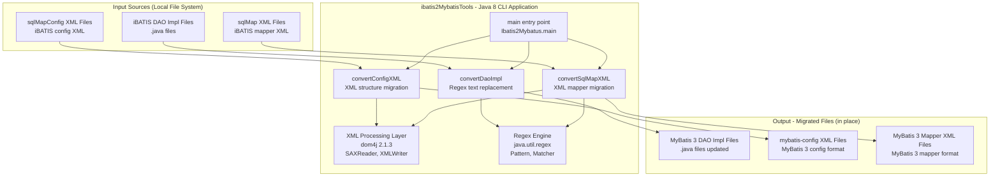

# Architecture Diagram

> Generated by the `assessment-diagram` skill for **ibatis2MybatisTools** (Java 8, Maven)

## Overview

`ibatis2MybatisTools` is a standalone Java command-line tool that automates migration of iBATIS 2 artefacts (DAO implementation files and XML configuration/mapper files) to MyBatis 3 format. It has no web layer, no database connections, and no external service dependencies.

## Architecture Diagram

## Technology Stack

| Layer | Technology | Version |
|-------|-----------|---------|
| Language | Java | 8 (source/target) |
| Build | Maven | 3.x |
| XML Parsing | dom4j | 2.1.3 |
| Regex Engine | java.util.regex | JDK built-in |
| File I/O | java.io | JDK built-in |
| Logging | System.out.println | (no framework) |

## Key Observations

- **No web/server layer**: Pure CLI tool invoked via `main()`
- **No database**: Reads and writes local files only
- **No external services**: Self-contained with a single third-party library (dom4j)
- **In-place transformation**: Output files overwrite the input files
- **Stateless**: No persistent state between runs
