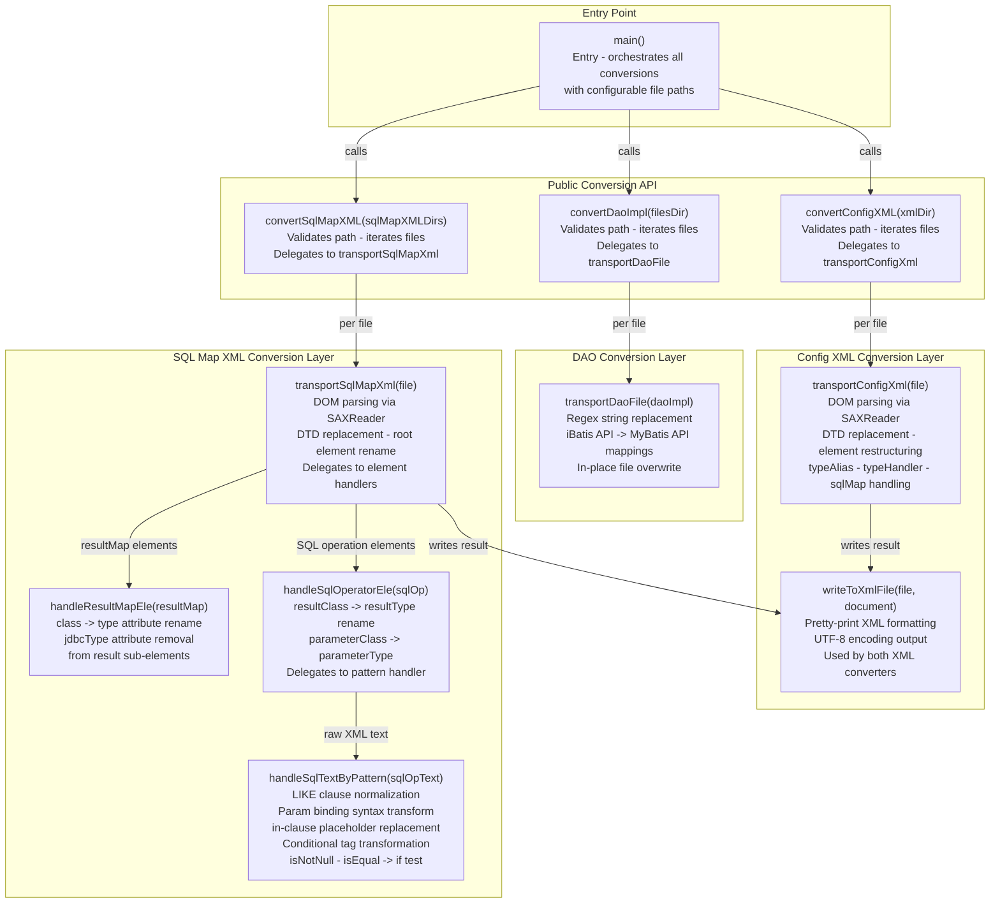

# Component Relationship Diagram

This diagram illustrates the internal component and method relationships within the single-class ibatis2MybatisTools application.

## Component Relationships

```mermaid
flowchart TD
    subgraph Entry["Entry Point"]
        Main["main()\nEntry - orchestrates all conversions\nwith configurable file paths"]
    end

    subgraph PublicAPI["Public Conversion API"]
        ConvDao["convertDaoImpl(filesDir)\nValidates path - iterates files\nDelegates to transportDaoFile"]
        ConvConfig["convertConfigXML(xmlDir)\nValidates path - iterates files\nDelegates to transportConfigXml"]
        ConvSqlMap["convertSqlMapXML(sqlMapXMLDirs)\nValidates path - iterates files\nDelegates to transportSqlMapXml"]
    end

    subgraph DaoLayer["DAO Conversion Layer"]
        TransportDao["transportDaoFile(daoImpl)\nRegex string replacement\niBatis API -> MyBatis API mappings\nIn-place file overwrite"]
    end

    subgraph ConfigLayer["Config XML Conversion Layer"]
        TransportConfig["transportConfigXml(file)\nDOM parsing via SAXReader\nDTD replacement - element restructuring\ntypeAlias - typeHandler - sqlMap handling"]
        WriteXml["writeToXmlFile(file, document)\nPretty-print XML formatting\nUTF-8 encoding output\nUsed by both XML converters"]
    end

    subgraph SqlMapLayer["SQL Map XML Conversion Layer"]
        TransportSqlMap["transportSqlMapXml(file)\nDOM parsing via SAXReader\nDTD replacement - root element rename\nDelegates to element handlers"]
        HandleResultMap["handleResultMapEle(resultMap)\nclass -> type attribute rename\njdbcType attribute removal\nfrom result sub-elements"]
        HandleSqlOp["handleSqlOperatorEle(sqlOp)\nresultClass -> resultType rename\nparameterClass -> parameterType\nDelegates to pattern handler"]
        HandleSqlText["handleSqlTextByPattern(sqlOpText)\nLIKE clause normalization\nParam binding syntax transform\nin-clause placeholder replacement\nConditional tag transformation\nisNotNull - isEqual -> if test"]
    end

    Main -->|calls| ConvDao
    Main -->|calls| ConvConfig
    Main -->|calls| ConvSqlMap

    ConvDao -->|per file| TransportDao

    ConvConfig -->|per file| TransportConfig
    TransportConfig -->|writes result| WriteXml

    ConvSqlMap -->|per file| TransportSqlMap
    TransportSqlMap -->|resultMap elements| HandleResultMap
    TransportSqlMap -->|SQL operation elements| HandleSqlOp
    TransportSqlMap -->|writes result| WriteXml
    HandleSqlOp -->|raw XML text| HandleSqlText
```
