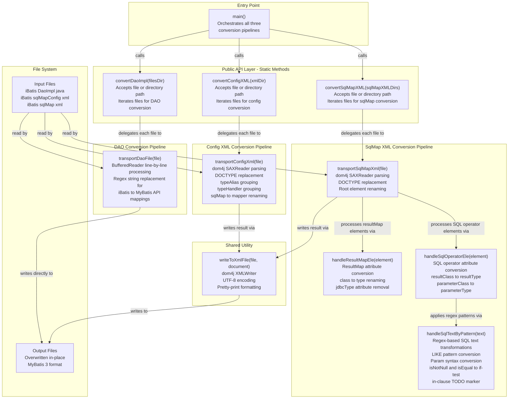

# Component Relationship Diagram

This project has a single-class structure (`Ibatis2Mybatus`) with three independent conversion pipelines sharing a common XML writer utility.

## Component Relationships

