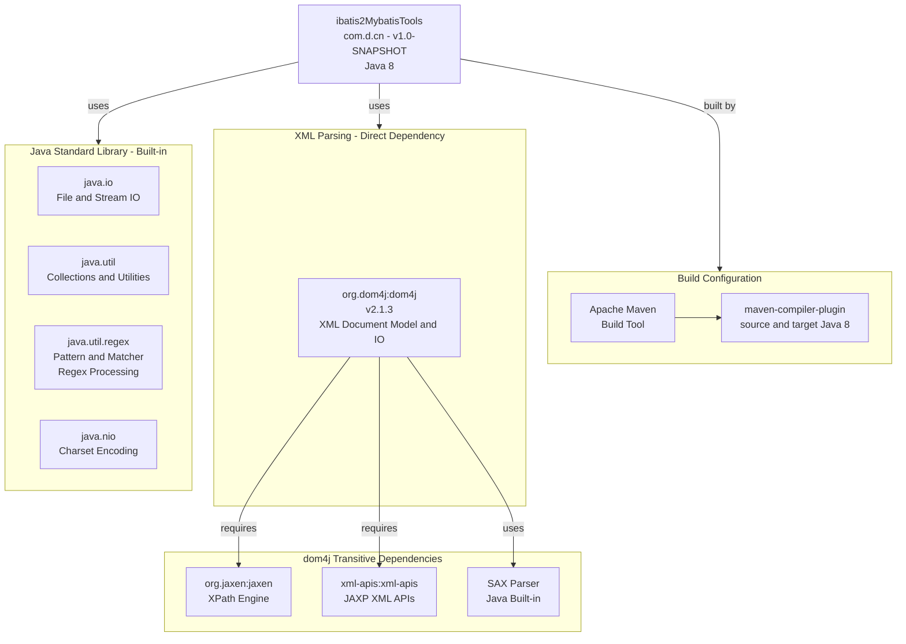

# Dependency Map

A standalone Java 8 Maven project with a single direct dependency on dom4j for XML processing.

## Project Dependency Map

```mermaid
flowchart TD
    App["ibatis2MybatisTools\ncom.d.cn - v1.0-SNAPSHOT\nJava 8"]

    subgraph Build["Build Configuration"]
        Maven["Apache Maven\nBuild Tool"]
        Compiler["maven-compiler-plugin\nsource and target Java 8"]
    end

    subgraph XMLParsing["XML Parsing - Direct Dependency"]
        Dom4j["org.dom4j:dom4j\nv2.1.3\nXML Document Model and IO"]
    end

    subgraph Dom4jTransitive["dom4j Transitive Dependencies"]
        Jaxen["org.jaxen:jaxen\nXPath Engine"]
        XmlApis["xml-apis:xml-apis\nJAXP XML APIs"]
        SAX["SAX Parser\nJava Built-in"]
    end

    subgraph JavaStdLib["Java Standard Library - Built-in"]
        JavaIO["java.io\nFile and Stream IO"]
        JavaUtil["java.util\nCollections and Utilities"]
        JavaRegex["java.util.regex\nPattern and Matcher\nRegex Processing"]
        JavaNio["java.nio\nCharset Encoding"]
    end

    App -->|uses| XMLParsing
    App -->|uses| JavaStdLib
    App -->|built by| Build

    Maven --> Compiler

    Dom4j -->|requires| Jaxen
    Dom4j -->|requires| XmlApis
    Dom4j -->|uses| SAX
```
