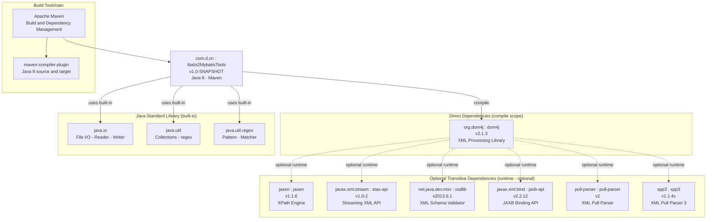

# Dependency Map

This diagram visualizes the dependency structure of the ibatis2MybatisTools project, a Java 8 Maven application with a single direct dependency.

## Project Dependency Map

```mermaid
flowchart TD
    App["com.d.cn : ibatis2MybatisTools\nv1.0-SNAPSHOT\nJava 8 - Maven"]

    subgraph Direct["Direct Dependencies (compile scope)"]
        Dom4j["org.dom4j : dom4j\nv2.1.3\nXML Processing Library"]
    end

    subgraph Optional["Optional Transitive Dependencies (runtime - optional)"]
        Jaxen["jaxen : jaxen\nv1.1.6\nXPath Engine"]
        StaxAPI["javax.xml.stream : stax-api\nv1.0-2\nStreaming XML API"]
        XsdLib["net.java.dev.msv : xsdlib\nv2013.6.1\nXML Schema Validator"]
        JaxbAPI["javax.xml.bind : jaxb-api\nv2.2.12\nJAXB Binding API"]
        PullParser["pull-parser : pull-parser\nv2\nXML Pull Parser"]
        Xpp3["xpp3 : xpp3\nv1.1.4c\nXML Pull Parser 3"]
    end

    subgraph StdLib["Java Standard Library (built-in)"]
        JavaIO["java.io\nFile I/O - Reader - Writer"]
        JavaUtil["java.util\nCollections - regex"]
        JavaRegex["java.util.regex\nPattern - Matcher"]
    end

    subgraph BuildTools["Build Toolchain"]
        Maven["Apache Maven\nBuild and Dependency Management"]
        CompilerPlugin["maven-compiler-plugin\nJava 8 source and target"]
    end

    App -->|compile| Dom4j
    Dom4j -.->|optional runtime| Jaxen
    Dom4j -.->|optional runtime| StaxAPI
    Dom4j -.->|optional runtime| XsdLib
    Dom4j -.->|optional runtime| JaxbAPI
    Dom4j -.->|optional runtime| PullParser
    Dom4j -.->|optional runtime| Xpp3

    App -->|uses built-in| JavaIO
    App -->|uses built-in| JavaUtil
    App -->|uses built-in| JavaRegex

    Maven --> App
    Maven --> CompilerPlugin
```
